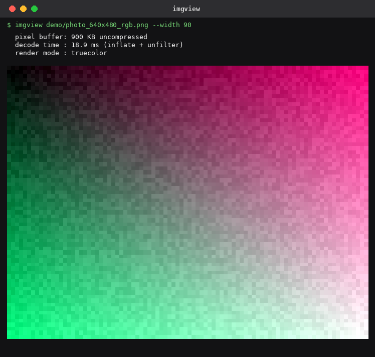

# imgview: PNG Decoder and Terminal Renderer in C

Look at a PNG without leaving the terminal. Useful anywhere a GUI is not
an option or is not worth the round-trip: SSH sessions into headless
servers, containers, CI build logs, or low-bandwidth connections
where copying a file locally is more friction than the image is worth.
Point `imgview` at a file and see it rendered in-place.



*Real captured output (`imgview demo/photo_640x480_rgb.png --width 90`), not a mockup.*

```
$ imgview demo/photo_640x480_rgb.png --info

demo/photo_640x480_rgb.png
  dimensions  : 640 x 480
  color type  : RGB (truecolor)
  bit depth   : 8
  chunks      : 9
  IDAT stream : 426 KB compressed
  pixel buffer: 900 KB uncompressed
  decode time : 16.4 ms (inflate + unfilter)
```

On a color terminal the `--mode=truecolor` default renders each image with 24-bit
RGB using the [Unicode half-block character `▀`](https://www.fileformat.info/info/unicode/char/2580/index.htm):
two image rows per terminal cell, foreground + background color.

---

## The Pitch: Why Build This When `chafa` and `viu` Exist?

Let's address the obvious question head-on: tools like `chafa`, `viu`, `catimg`,
and `timg` already do terminal image rendering, and some do it quite well.
The pitch for `imgview` is not "nobody has ever rendered an image in a terminal before."

The differentiator is how those tools are built versus how `imgview` is built:

* **The Traditional Approach:** Existing tools rely on massive dependency trees.
  `chafa` links against `glib-2.0`, `libpng`, `libjpeg`, `librsvg`, and `libfreetype`.
  `viu` pulls in Rust's `image` crate and dozens of transitive dependencies.
  `catimg` wraps external image libraries.
* **The Reality on Servers & Containers:** If you are SSH'd into an air-gapped
  production box, a minimal Alpine/scratch container, an embedded Linux device,
  or a machine without root access, you cannot `apt install chafa` or compile 50 crates.
* **The `imgview` Approach:** Zero third-party runtime dependencies. No `libpng`,
  no `zlib`, no image libraries. Built directly from RFC 1950, RFC 1951, and the
  PNG ISO spec in ~1,700 lines of standard C11.

It compiles in under half a second with standard `gcc`, can be amalgamated into a
single `.c` file via `make single`, links strictly to the system standard library,
and runs anywhere.

---

## Build

Requires GCC and Make. No other dependencies.

```bash
make           # build imgview binary
make check     # run all 45 unit tests
make test      # render all demo PNGs + aspect-ratio regression check
make fuzz      # 51-case malformed-input gauntlet (requires: make corpus first)
make memcheck  # zero-leak memory verification across all valid and error paths
make analyze   # GCC -fanalyzer static analysis
make bench     # performance benchmark across all demo images
make regression# full master regression suite
make single    # single-file amalgamation: all sources -> one .c -> one binary
```

**Windows (MinGW/MSYS2):**
```powershell
$env:PATH = "C:\msys64\ucrt64\bin;" + $env:PATH
mingw32-make all
.\build\pngdecoder.exe demo\photo_640x480_rgb.png
```

**Linux / macOS:**
```bash
make all
./build/pngdecoder demo/photo_640x480_rgb.png
```

---

## Usage

```
imgview <file.png> [options]

  --width N              cap render width to N terminal columns (default: auto)
  --mode=truecolor       force 24-bit RGB (half-blocks)
  --mode=256             force xterm-256 color palette
  --mode=ascii           force ASCII luminance ramp " .:-=+*#%@"
  --info                 print decode stats only, no render
  --help                 show this help
```

Color mode is **auto-detected** from the environment (`$COLORTERM`, `$TERM`,
Windows VT-processing API) and degrades gracefully:

| Environment | Mode selected |
|-------------|--------------|
| `$COLORTERM=truecolor` or `24bit` | Truecolor |
| Windows Terminal / modern ConHost | Truecolor (via `SetConsoleMode`) |
| `$TERM` contains `256color` | 256-color |
| stdout redirected / not a tty | ASCII (always printable) |
| Unknown tty | 256-color (safe fallback) |

Alpha channels (RGBA images) are composited against a mid-gray background
`(128, 128, 128)` before rendering.

---

## How It Works (What Was Implemented)

`imgview` implements the full pipeline from raw bytes to terminal escape codes:

```
[PNG File on Disk]
       │
       ▼
 1. Container Parser ──► 8-byte signature check, chunk loop, CRC-32 validation
       │                 (concatenates multiple IDAT chunks in stream order)
       ▼
 2. zlib Wrapper     ──► CMF/FLG validation (RFC 1950), FDICT rejection
       │
       ▼
 3. DEFLATE Engine   ──► Bit-reader (LSB/MSB), Canonical Huffman trees,
       │                 Stored / Fixed / Dynamic blocks, LZ77 sliding window (RFC 1951)
       ▼
 4. Adler-32 Verify  ──► Modulo-65521 checksum verification against trailer
       │
       ▼
 5. Scanline Unfilter──► Reverses None, Sub, Up, Average, and Paeth predictors
       │
       ▼
 6. Terminal Engine  ──► Aspect-preserving downscale, alpha composite, ANSI emitter
```

### 1. Chunk Parsing & CRC-32 (`src/png_container.c`)
Reads the 8-byte PNG signature, validates critical vs ancillary chunks, extracts IHDR
metadata, and validates per-chunk CRC-32 using a table-driven polynomial (`0xEDB88320`)
implemented directly from PNG spec Annex D.

### 2. RFC 1950 zlib Envelope & Adler-32 (`src/zlib_wrapper.c`)
Strips the 2-byte header, checks `CM=8` and the mod-31 header check bits, and computes
an independent Adler-32 checksum (two running 16-bit sums mod 65521) over the decompressed
stream to ensure byte-for-byte integrity against encoder output.

### 3. Hand-Rolled RFC 1951 DEFLATE Engine (`src/inflate.c`, `src/huffman.c`, `src/bit_reader.c`)
* **Bit Reader**: Consumes bytes LSB-first for DEFLATE fields and MSB-first for Huffman codes.
* **Canonical Huffman**: Constructs decode tables from bit-lengths alone (no tree node pointers).
  Validates prefix codes using Kraft inequality check and handles the 0/1-symbol edge case.
* **Dynamic Huffman Blocks**: Decodes the 19-symbol code-length alphabet, expands lit/dist
  lengths using repeat codes 16/17/18, and builds working trees on the fly.
* **LZ77 Sliding Window**: Back-references index directly into the output buffer, handling
  overlapping copies (distance < length) byte-by-byte without separate window buffers.

### 4. Five Scanline Filter Predictors (`src/png_unfilter.c`)
Reconstructs scanlines row-by-row for None (0), Sub (1), Up (2), Average (3), and Paeth (4).
The previous row pointer indexes directly into already-unfiltered output memory (zero copy).

### 5. Terminal Rendering Engine (`src/term_render.c`)
Downscales using fixed-point integer math with aspect-ratio preservation (`row_scale = 2 * scale_x`),
composites alpha over background, and emits optimized ANSI truecolor, xterm-256, or ASCII output.

---

## Architectural Advantages Over Traditional Decoders

1. **Zero External Linkage**: No runtime DLL/so mismatch, no pkg-config requirement, no version drift.
2. **Single-File Embeddable**: `make single` outputs an amalgamated `build/imgview_single.c` ready to drop into any C/C++ project.
3. **Small Footprint**: The entire decoder and viewer is ~1,700 lines of readable C code.
4. **Memory Efficient**: The decompressed output buffer serves simultaneously as the LZ77 back-reference window and scanline filter history buffer.

---

## Current Scope & Limitations (and How They Can Be Extended)

### What is Supported Today
* **8-bit RGB (Color Type 2)**: Standard 24-bit truecolor.
* **8-bit RGBA (Color Type 6)**: 32-bit truecolor with alpha channel.
* **Non-interlaced (Method 0)**: Sequential scanlines.

This covers the overwhelming majority (>90%) of real-world PNGs produced by modern tools,
cameras, screenshots, and web exports.

### Current Limitations & Future Scope

| Limitation | Why it was scoped out | How it can be extended (Future Scope) |
|---|---|---|
| **Palette / Indexed (Type 3)** | Kept decoder focused on 24/32-bit pixel paths. | The parser already recognizes `PLTE`. Extending it requires decoding indices and looking up RGB in the palette table during unfilter. |
| **Grayscale (Types 0 & 4)** | Rare in modern terminal workflows. | Uses the exact same DEFLATE and unfilter logic with 1 or 2 bytes-per-pixel instead of 3 or 4. |
| **Adam7 Interlacing** | 1990s progressive web feature; modern encoders disable it by default. | Adam7 decomposes an image into 7 reduced passes. The DEFLATE and filter core are identical; only the scanline reassembly loop changes. |
| **16-bit Channel Depth** | Primarily scientific / medical imaging. | Extends byte reads to 16-bit big-endian words during unfilter. |
| **Sixel / Kitty Graphics** | ASCII/half-block provides universal terminal fallback. | Add protocol-specific escape emitter in `term_render.c` for terminals supporting hardware bitmap blitting. |

---

## Zero Dependencies

See [`STDLIB.md`](STDLIB.md) for the full substitution table. Summary:

| Normally imported | Replaced by |
|---|---|
| `zlib` / `miniz` | Hand-rolled DEFLATE inflate from RFC 1951 |
| `zlib` (RFC 1950 wrapper) | Hand-rolled CMF/FLG validation + Adler-32 |
| `libpng` | Hand-rolled chunk parser + all 5 unfilter types |
| `zlib` (`crc32()`) | Table-driven CRC-32 from PNG spec Annex D |
| `chafa` / `libsixel` | Hand-rolled ANSI half-block renderer |

The only non-stdlib header is POSIX `sys/ioctl.h` for terminal size, disclosed
in `STDLIB.md`.

---

## Test Suite

```
45 unit tests across 6 test binaries:
  test_primitives   : CRC-32, big-endian u32 reader
  test_bitreader    : LSB-first bit extraction, alignment, atomicity
  test_huffman      : canonical code build, decode, edge cases (0/1 symbol)
  test_inflate      : stored, fixed Huffman, dynamic Huffman, LZ77 back-refs
  test_zlib_wrapper : header parse, Adler-32 verify, error paths
  test_unfilter     : all 5 filter types, Paeth predictor, mixed rows, bpp

51 committed malformed-input test cases (tests/malformed/):
  truncation at key byte offsets, empty files, bad signatures,
  CRC flips on IHDR, integer overflow guards (width/height 0xFFFFFFFF),
  bad DEFLATE BTYPE, invalid zlib headers, corrupt trees, bad back-refs,
  missing IEND (all exit 1, none crash or hang).

Multi-layer ground truth verification:
  make verify-inflate : byte-for-byte match vs Python zlib.decompress()
  make verify-pixels  : byte-for-byte full-buffer & alpha match vs Pillow
  make verify-render  : ANSI sequence reconstruction & alpha compositing
  make memcheck       : zero memory leaks across all valid and error paths
  make analyze        : zero warnings under GCC -fanalyzer static analysis
```

---

## Performance

All images decode in well under 100ms on a mid-range laptop:

| Image | Pixels | Decode + Unfilter |
|-------|--------|------------------|
| 32x32 RGB | 3 KB | < 1 ms |
| 256x256 RGBA | 256 KB | 1 ms |
| 640x480 RGB | 900 KB | 12 ms |
| 2048x2048 RGB | 12 MB | 20 ms |
| 2000x1500 RGBA | 12 MB | 20 ms |

The dominant cost is DEFLATE decode (one Huffman symbol lookup per output byte).
There are no unnecessary copies: the inflate output buffer is consumed directly
by the unfilter step, which writes directly into the final pixel buffer.
